1. Definição de arquiterura
2. Arquiteruras típicas
   - Cliente-servidor
   - Cliente-servidor em cadeia e servidores replicados
   - Cliente-servidor com código movel
   - Peer-to-peer
## Definição
- As <ins>relações</ins> entre estes componentes;
- A <ins>divisão</ins> de responsabilidades (Ex. Cliente-servidor)
- A <ins>Localização</ins> dos componentes do sistema
- E como estes componentes são <ins>mapeados</ins> para a infra-estrutura de rede
## Papeis funcionais

## Cliente-servidor
- 1 Servidor;
- Varios servidores;
  - Em cadeia;
  - Replicados;
- Com código móvel(applets)
- Push
- Network Computer
- Thin-client
## Peer-to-peer
- Pura: Desentralizada
- Híbrida com cliente-servidor
### Exemplo de cliente-servidor

### Exemplo de cliente-servidor em cadeia

### Exemplo Arquitetura cliente-servidor replicados
![[Arquitetura4.svg]]
### Exemplo servidor com código móvel
![[Arquitetura5.svg]]
### Push
![[diagramas/Arquitetura6.svg]]
### Peer-to-peer
- Processos desempenham papeis similares
	- Não há distinção entre cliente e servidor
![[Arquitetura7.svg]]
- Não há autoridade central
- Pacote contem informações sobre o proximo **step**
![[Arquitetura8.svg]]