$f(n) = O(g(n))$
"Lê-se $f(n)$ é Big O de $g$ de $n$"
Se existirem constantes posicionadas $c$ e $n_0$ tais que $f(n)<= c \text{ x } g(n)$ para todos os $n>=n_0$ 
### Notação Big Omega(Ω)
A notação Ω nos fornece uma simbologia simplificada para representar um limite inferior de desempenho para um algoritimo. Isto é, um limite minimo de tempo que um algoritimo leva para ser executado
### Exemplos para função linear
**Quando dizemos:**
$4n-3$ é $Ω(n)$ ("lê-se" é ômega de n") estamos afirmando que o comportamento assimtótico de uma função linear é igual ou inferior ao dela.
Significa dizer que a função $4n-3$ nunca terá um comportamento de crescimento inferior ao de uma função com o comportamento linear.
Assim $Ω(n)$ apresenta-se como um limite inferior a $f(n)$

Da mesma forma $4n-3$ é $Ω(1)$ pois $f(n)$ funciona apresentará um comportamento de crescimento que seja ultrapassado por comportamento constante

#### Outro exemplo:
$4n-3$ não é $Ω(2^2)$ pois $fn)$ nunca crescera a ponto de ultrapassar o comportamentp quadratico.

### Definição matemática formal
$f(n)=Ω(g(n))$ ("lê-se $f(n)$ é $Ω(g(n))$") se existirem constantes positivas $c$ e $n_0$, tais que:

$f(n)>=c \times g(n)$ para todos os $n>=n_0$